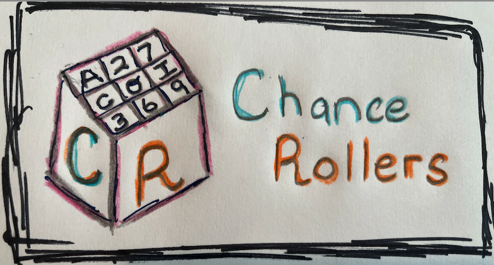

<h1 align="center">

</h1> 

Chance Rollers is die rolling simulator package.

- **Source code:** https://github.com/d26clarke/DS5100-Project/tree/main

The Features:

- Generate multiface die with die specific weights
- Alter die specific weights
- Die can be rolled one (1) to n times per game
- Display game results to include jackpot results
- Computes how many times a given face is rolled in each event
- Computes the distinct combinations of faces rolled, along with their counts
- Computes the distinct permutations of faces rolled, along with their counts
- Computes how many times a given face is rolled in each event

Synopsis:

Installation:

    At your system command prompt,
    pip install chanceRollers
        result:
            Obtaining ChanceRollers
        Installing build dependencies ... done
        Checking if build backend supports build_editable ... done
        Getting requirements to build editable ... done
        Preparing editable metadata (pyproject.toml) ... done
        Requirement already satisfied: numpy in /Users/ddclarke/.pyenv/versions/3.12.7/lib/python3.12/site-packages (from Chance-Rollers==3.0) (2.1.3)
        Requirement already satisfied: pandas in /Users/ddclarke/.pyenv/versions/3.12.7/lib/python3.12/site-packages (from Chance-Rollers==3.0) (2.2.3)
        Requirement already satisfied: python-dateutil>=2.8.2 in /Users/ddclarke/.pyenv/versions/3.12.7/lib/python3.12/site-packages (from pandas->Chance-Rollers==3.0) (2.9.0.post0)
        .............
        Successfully built Chance-Rollers
        Installing collected packages: Chance-Rollers
        Successfully installed Chance-Rollers-3.0

    import required modules
        For Example: Let's play a game where we create three die, give the three die the same weight
                        and roll the three die ten (10) times.  You will be able to review the results and see if 
                        you hit any jackpots!  You will also be able to see differing combinations and permutations
                        of your die rolls.

        In a file called chanceRollersDemo.py, use the following code sample

            from theDie.die import Die
            from analyze.analyzer import Analyzer
            from game.game import Game

            # The Die
            listDieOne: np.array = np.array(['1', '2', '3', '4', '5', '6'], dtype=str)
            listDieTwo: np.array = np.array(['1', '2', '3', '4', '5', '6'], dtype=str)
            listDieThree: np.array = np.array(['1', '2', '3', '4', '5', '6'], dtype=str)
            
            dieOneInstance: Die = Die(listDieOne)
            dieTwoInstance: Die = Die(listDieTwo)
            dieThreeInstance: Die = Die(listDieThree)
            
            #Manage Die weighting
            dieOneInstance.change_die_weight('2', .20)
            dieTwoInstance.change_die_weight('2', .20)
            dieThreeInstance.change_die_weight('2', .20)

            diceList: list = [dieOneInstance, dieTwoInstance, dieThreeInstance]

            myInstance: Game = Game(diceList)

            #Let it roll!
            myInstance.play(10)

            myAnalyzerInstance: Analyzer = Analyzer(myInstance) 
            #myAnalyerErr: Analyzer = Analyzer(myErrorInstance)

            #Jackot Information
            print(f"Did I hit any jackpots? \n{myAnalyzerInstance.jackpots()}")

            print(f"Play Results(Wide Format): \n{myAnalyzerInstance.dieFaceCounter()}")

            #print(f"Play Results(Narrow Format): \n{myInstance.playResults("x")}")

            print(f"Play Results(Wide Format): \n{myAnalyzerInstance.dieComboCounter()}")

            print(f"Play Results(Wide Format): \n{myAnalyzerInstance.diePermutationCounter()}")

API description
----------------------

## die.py
<code>
    class Die:
    """
    A class representing a Die (2-Face: Die of type Coin or 6-Face Die )

    Attributes:
       
        
    
    Methods:
        __init__():
        change_die_weight() 
        roll_die() defaults to (1)
        die_state()
    """

</code>

## game.py
<code>
class Game:
    """
    A class representing a game of rolling one or more similar dice (Die objects) one or more times
    Game objects have a behavior to play a game, i.e. to roll all of the dice a given number of times
    Game objects only keep the results of their most recent play

    Attributes:
       
        
    
    Methods:
        play() 
        playResults() Defaults to wide dataframe type (w)
    """

          
</code>
## analyzer.py
<code>
 
class Analyzer:
    """
    A class that provides descriptive statistical properties about a game object

    Attributes:
       
        None
    
    Methods:
        jackpots() 
        dieFaceCounter()
        dieComboCounter()
        diePermutationCounter()
    """

  
</code>

